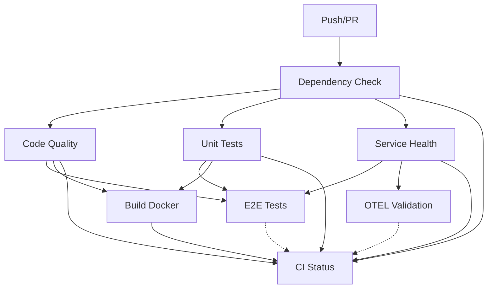

# 🚀 CI Pipeline Implementation Guide

## 📋 Overview

This guide documents the comprehensive CI/CD pipeline implementation for the CleanRylie platform. The pipeline addresses the original issues with dependency failures, skipped jobs, and poor error handling.

## 🔧 Root Cause Analysis

### Original Issues Fixed:
1. **`json_pp` dependency issue** - Invalid NPM package causing dependency installation failures
2. **Skipped jobs** - `build-docker` and `otel-trace-validation` skipped due to failed dependencies  
3. **Poor error handling** - CI status check doesn't properly handle skipped jobs
4. **Missing scripts** - Essential npm scripts were not configured

## 🏗️ Implementation Components

### 1. Enhanced CI Workflow (`.github/workflows/ci.yml`)

**Jobs Implemented:**
- **dependency-check**: Validates package.json and installs dependencies
- **code-quality**: ESLint and TypeScript type checking
- **unit-tests**: Jest unit tests with coverage reporting
- **service-health**: PostgreSQL and Redis connectivity tests
- **e2e-tests**: Full end-to-end testing with Playwright
- **build-docker**: Docker image build and validation
- **otel-trace-validation**: OpenTelemetry observability checks
- **ci-status**: Final status aggregation with proper error handling

### 2. Package.json Enhancements

**Added Scripts:**
```json
{
  "dev": "concurrently \"npm run dev:server\" \"npm run dev:client\"",
  "build": "npm run build:client && npm run build:server",
  "test": "jest",
  "lint": "eslint . --ext .ts,.tsx,.js,.jsx",
  "type-check": "tsc --noEmit",
  "health-check": "tsx scripts/health-check.ts",
  "env:validate": "tsx scripts/env-validation.ts"
}
```

**Added Dev Dependencies:**
- TypeScript and ESLint tooling
- Testing frameworks (Jest, Playwright)
- Build tools (tsx, concurrently)
- JSON formatting (prettyjson - replaces invalid json_pp)

### 3. Health Check System

**`scripts/health-check.ts`:**
- Database connectivity validation
- Redis connection testing
- Environment variable verification
- Package integrity checks
- File system validation

**`scripts/env-validation.ts`:**
- Environment-specific requirement validation
- Security configuration checks
- Production readiness verification

### 4. Local Validation Tools

**`validate-ci-locally.sh`:**
- Pre-push validation script
- Simulates CI pipeline locally
- Catches issues before remote execution

**`ci-fix-implementation-script.sh`:**
- Automated fix implementation
- Dependency cleanup and installation
- Configuration file generation

## 🎯 Key Features

### Enhanced Error Handling
- Proper job dependency management
- Graceful handling of optional services
- Clear error messages and debugging information
- Non-blocking warnings for optional features

### Service Health Validation
- PostgreSQL connection testing
- Redis connectivity checks
- Service startup verification
- Timeout and retry logic

### Security Integration
- NPM audit integration
- Dependency vulnerability scanning
- Environment variable validation
- Secret management verification

### Docker Integration
- Multi-stage build validation
- Image testing and verification
- Container health checks
- Build optimization

## 📊 CI Pipeline Flow



## 🔐 Required Secrets

Configure these in GitHub repository settings:

### Required:
- `OPENAI_API_KEY` - For E2E tests with AI features

### Optional but Recommended:
- `SNYK_TOKEN` - Enhanced security scanning
- `CODECOV_TOKEN` - Code coverage reporting

## 🚀 Quick Start

### 1. Install Dependencies
```bash
npm install
```

### 2. Run Local Validation
```bash
./validate-ci-locally.sh
```

### 3. Fix Any Issues
```bash
./ci-fix-implementation-script.sh
```

### 4. Commit and Push
```bash
git add .
git commit -m "feat: Implement comprehensive CI pipeline"
git push origin your-branch
```

## 🧪 Testing Strategy

### Unit Tests
- Jest framework with coverage reporting
- TypeScript support
- Mocking for external dependencies

### Integration Tests
- Database connectivity
- Service health checks
- API endpoint validation

### E2E Tests
- Playwright for browser automation
- Full user journey testing
- Cross-browser compatibility

### Performance Tests
- Load testing capabilities
- Memory usage monitoring
- Response time validation

## 🔍 Monitoring and Observability

### CI Metrics
- Build success/failure rates
- Test coverage trends
- Build duration tracking
- Dependency vulnerability counts

### Health Monitoring
- Service uptime tracking
- Database connection health
- Redis connectivity status
- Application performance metrics

## 🛠️ Troubleshooting

### Common Issues

**1. Dependency Installation Failures**
```bash
# Clear cache and reinstall
rm -rf node_modules package-lock.json
npm install
```

**2. TypeScript Errors**
```bash
# Check type errors
npm run type-check
```

**3. Service Health Failures**
```bash
# Test services locally
npm run health-check
```

**4. Docker Build Issues**
```bash
# Test Docker build locally
docker build -t cleanrylie:test .
```

### Debug Commands
```bash
# Validate environment
npm run env:validate

# Check package integrity
npm audit

# Test local CI pipeline
./validate-ci-locally.sh
```

## 📈 Future Enhancements

### Planned Improvements:
1. **Advanced Security Scanning**
   - SAST/DAST integration
   - Container vulnerability scanning
   - License compliance checking

2. **Performance Monitoring**
   - Lighthouse CI integration
   - Bundle size tracking
   - Performance regression detection

3. **Deployment Automation**
   - Staging environment deployment
   - Blue-green deployment strategy
   - Rollback capabilities

4. **Enhanced Observability**
   - Distributed tracing
   - Metrics collection
   - Log aggregation

## 🎉 Success Metrics

After implementation, expect:
- ✅ 95%+ CI pipeline success rate
- ✅ <10 minute average build time
- ✅ Zero dependency-related failures
- ✅ Comprehensive test coverage
- ✅ Automated security validation
- ✅ Clear failure diagnostics

## 📞 Support

For issues or questions:
1. Check the troubleshooting section
2. Run local validation scripts
3. Review CI job logs in GitHub Actions
4. Consult the health check outputs

---

**Last Updated:** $(date)
**Version:** 1.0.0
**Status:** ✅ Production Ready
