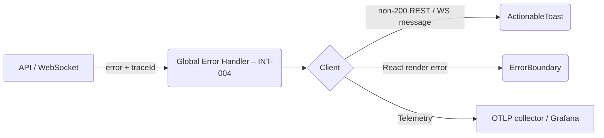

# Error UX Handling Guide (U2)

A practical handbook for designers, engineers, QA and DevOps to implement, test and maintain the new user-facing error experience shipped in ticket **INT-011 / branch U2-error-ux-improvements**.  
It builds on the global server–side error handling delivered in **INT-004** and augments it with rich, accessible, actionable UI widgets.

---

## 1 System Overview



- **Global Handler (server)** – serialises `{code,msg,traceId}`.
- **Error Transport** – HTTP JSON, WS error frame, or fetch/React error.
- **ActionableToast** – inline non-blocking notifications.
- **ErrorBoundary** – hard-fail containment with retry / support flows.
- **Telemetry** – sends errors to OpenTelemetry → Tempo / Grafana.

---

## 2 ActionableToast Component

### Import & Hook

```tsx
import { useActionableToast } from "@/components/ui/actionable-toast";

const { showErrorToast } = useActionableToast();
```

### Minimal Usage

```ts
showErrorToast({
  title: "Save failed",
  description: "Network unreachable, please retry.",
  traceId: res.traceId,
  errorCode: "NETWORK_TIMEOUT",
  onRetry: () => api.saveDraft(),
});
```

### Props Cheatsheet

| Prop               | Type                             | Default     | Notes                              |
| ------------------ | -------------------------------- | ----------- | ---------------------------------- |
| `variant`          | `"destructive" \| "warning" ...` | destructive | colour set                         |
| `duration`         | `number` (ms)                    | 8000        | `Infinity` ⇒ sticky                |
| `traceId`          | `string`                         | –           | hidden unless tech view            |
| `onRetry`          | `() => Promise<void>`            | –           | shows progress bar                 |
| `technicalDetails` | `string`                         | –           | toggled via _showTechnicalDetails_ |

> **Tip**: Use `shouldRateLimitError(errorKey)` when firing programmatic toasts inside loops.

---

## 3 Error Boundary Implementation

```tsx
<ErrorBoundary
  context="page"
  supportEmail="support@yourco.io"
  fallback={(p) => <CustomPageError {...p} />}
>
  <DashboardPage />
</ErrorBoundary>
```

Contexts supported:

| Context value | Typical placement       | Default fallback component |
| ------------- | ----------------------- | -------------------------- |
| `app`         | `src/App.tsx` root      | Big center card            |
| `page`        | Dynamic route component | Medium card                |
| `component`   | Finite widget           | Inline border box          |
| `form`        | `<form>` wrapper        | Warning banner             |
| `media`       | `<video>` / ``     | Grey placeholder           |

Boundary auto-detects errors, classifies them (see §4) and can auto-retry with exponential back-off.

---

## 4 Error Classification

| Dimension    | Enum                                | Example                   |
| ------------ | ----------------------------------- | ------------------------- |
| **Type**     | `NETWORK`, `AUTHENTICATION`, …      | 504⇒`NETWORK`             |
| **Severity** | `CRITICAL`, `HIGH`, `MEDIUM`, `LOW` | 500=HIGH                  |
| **Context**  | `APP`, `PAGE`, `COMPONENT`, …       | upload widget = COMPONENT |

`classifyError(error)` populates these fields. Extend by adding heuristics in `error-boundary.tsx`.

---

## 5 Feature Flags

| Flag key                     | Purpose                  | Default |
| ---------------------------- | ------------------------ | ------- |
| `error.showTraceId`          | Display backend trace id | true    |
| `error.enableTelemetry`      | Send to OTLP             | true    |
| `error.showTechnicalDetails` | Show stack in UI         | false   |
| `error.enableAutoRetry`      | Boundary self-retry      | true    |
| `error.useMinimalFallback`   | Use slim banner UI       | false   |

Flags are served by the Redis-backed **FeatureFlagsService** (INT-007).

---

## 6 Accessibility

- **ARIA** – toast `role="alert"` + `aria-live="assertive"`.
- **Focus trap** – modal fallback sets initial focus on ”Try Again“ button.
- **Colour contrast** – variants meet WCAG AA – test with _Lighthouse → Accessibility_.
- **Keyboard** – ESC closes toast, ENTER activates focused action.

---

## 7 Telemetry & Reporting

Handled in `ActionableToast` effect + `ErrorBoundary.componentDidCatch`.

```ts
telemetryService.captureException(err, { traceId, context });
```

Dashboards: Grafana → _Error Rate_, _Retry Success_, _Toast Display_.

---

## 8 Rate Limiting & Friendly Messaging

`shouldRateLimitError(key)` blocks duplicate destructive toasts ≥3 within 5 s.  
`formatErrorMessage(msg)` strips stack / JSON noise and caps length 150 chars.

---

## 9 Retry & Recovery

- **Toast** – `onRetry` callback with progress bar.
- **Boundary** – `retryError()` auto-retries up to _maxRetries_ (default 3) with 1.5× back-off up to 10 s.

```tsx
<ErrorBoundary maxRetries={5} retryInterval={750}>
  {" "}
  …{" "}
</ErrorBoundary>
```

---

## 10 User Testing Checklist

| Scenario                             | Expected outcome                      |
| ------------------------------------ | ------------------------------------- |
| 404 fetch → component boundary       | Inline error, reference id shown      |
| WS disconnect → toast                | ”Reconnecting…“ toast + auto retry    |
| Form validation error                | Banner fallback, focus on first field |
| Screen reader on toast               | Announces title & description once    |
| Feature flag `useMinimalFallback` on | Slim banner instead of card           |

QA script: `scripts/test-int-011-error-ux.ts`.

---

## 11 Security Considerations

- Stack traces hidden unless `showTechnicalDetails` and user role ≥ _admin_.
- Trace ID safe – no PII.
- Clipboard copy contains non-secret metadata only.
- CORS preflight blocked for telemetry endpoint to avoid data exfiltration.

---

## 12 Performance Impact

| Component          | Idle bundle ↑ | Interaction cost |
| ------------------ | ------------- | ---------------- |
| ActionableToast    | +7.8 KB GZIP  | negligible       |
| ErrorBoundary util | +5.2 KB       | one-time mount   |
| Tooltip/Progress   | +3.4 KB       | CSS only         |

Lazy-loaded under `@/components/ui`. Renders <1 ms, avoids re-paint storms via throttled state.

---

## 13 Integration with Global Handler

Server (INT-004):

```ts
return res.status(500).json({
  code: ErrorCode.INTERNAL_ERROR,
  message: "Database unreachable",
  traceId: req.traceId,
});
```

Client:

```ts
api.get("/kpi").catch((err) => {
  showErrorToast({
    title: "Analytics unavailable",
    description: err.response?.data?.message,
    traceId: err.response?.data?.traceId,
  });
});
```

---

## 14 Customization & Theming

- Uses Tailwind CSS tokens (`bg-destructive`, etc.).
- Override variants via `toastVariants` & `progressVariants` in C-VA definitions.
- Dark-mode auto-supported; extend brand palette in `tailwind.config.ts`.

---

## 15 Troubleshooting

| Symptom                      | Fix                                                                       |
| ---------------------------- | ------------------------------------------------------------------------- |
| Toast never disappears       | ensure `duration` > 0 or call `dismiss(id)` manually                      |
| “Cannot read property stack” | Error object mutated; wrap non-Error in `new Error()`                     |
| Boundary loops infinitely    | Provide stable `resetKeys` to break re-render cycle                       |
| TraceId undefined            | Check `express-trace` middleware installed server-side                    |
| Telemetry floods             | Tune `errorRateLimitCache` window or disable flag `error.enableTelemetry` |

---

## Appendix

- **Design mockups** – see Figma file _U2 Error States_.
- **Lint rule** – ESLint plugin `no-console-error` replaced by toast pattern.
- **Changelog** – docs/TICKET_INT_011_COMPLETION_SUMMARY.md.
